<div align="center">

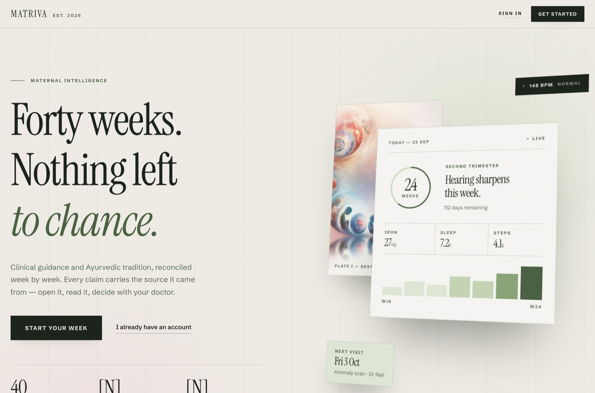

# 🌿 MATRIVA

### *Forty weeks. Nothing left to chance.*

**An evidence-first pregnancy companion for India — one chat window for guidance, tracking and safety.**
Modern guidelines and classical Ayurveda, reconciled week by week. Every answer names its source, or says plainly that it can't.

<p>


</p>
<p>


</p>
<p>


</p>

[**What it is**](#-what-is-matriva) · [**Features**](#-what-it-does) · [**See it**](#-see-it) · [**How it works**](#-how-an-answer-is-made) · [**Safety**](#-safety-by-design) · [**What to eat**](#-what-to-eat) · [**Run it**](#-run-it) · [**Docs**](#-documentation) · [**Limits**](#-honest-limits) · [**Roadmap**](#-roadmap)

</div>

> [!IMPORTANT]
> MATRIVA is **guidance, not a diagnosis**. It does not replace a doctor or emergency care. Health thresholds and screening rules are sourced but **not yet signed off by a clinician**; the Hindi/Gujarati warning phrases need native-speaker review. Do not put it in front of real patients before that review. See [Honest limits](#-honest-limits).

---

## 👋 What is MATRIVA?

MATRIVA is a pregnancy companion for India that lives in a single chat window. A mother can ask a question in English, Hindi, Hinglish or Gujarati, log how she feels, record a haemoglobin reading or a meal, see her visit calendar, and get one printable page for her doctor, without hunting through menus.

It is built for **mothers, and for the ANM, ASHA or doctor who looks after them**. What it gives back is always one of three things: an answer quoted from a reviewed source with the source named, a plain "I don't have a reviewed source for that", or a push towards a real person (112, a doctor, a helpline).

It is **not** a doctor. It does not diagnose, prescribe, dose, or tell anyone to start, stop or change a medicine.

---

## 🎯 Why it exists

A pregnant woman asks *can I eat papaya? is this headache normal? what does Ayurveda say about the third month?* and gets answers that blend modern guidelines with unverified tradition, with no sign of which is which, how strong the evidence is, or when to stop reading and call a doctor.

Two failures matter more than any feature, and everything here is built around them:

1. **A confident wrong answer**: an invented dose, a made-up rule.
2. **A missed emergency**: bleeding, a severe headache with swelling, a baby that has stopped moving, handled as an ordinary wellness question.

So MATRIVA answers only from approved sources, refuses what it cannot source, never advises on medicines, and sends emergencies to 112 before it does anything else. The story of how it got there, including what failed, is in the [tech blog](./docs/TECH_BLOG.md).

---

## ✨ What it does

Everything lives in **one chat window**. Ask in your own words, tap a sidebar shortcut, or type `/` for commands. There are no feature pages to hunt through.

| | Command | What you give it | What you get back |
|---|---|---|---|
| 🗓️ | `/plan` | Last period date, due date, or current week | Exact week and day, due date, visit calendar (FOGSI), free PMSMA check-up on the 9th, iron-folic-acid course, this week's tasks |
| 💚 | `/checkin` | Mood, symptoms, baby movement, iron tablet (20 seconds) | Streaks, reminders, and an immediate warning card if an answer is a danger sign |
| 🛡️ | `/check` | Yes/no questions filtered by your week | **Emergency / urgent / soon** outcome with one-tap **112**, your emergency contact and a hospital map link |
| 🩸 | `/readings` | Hb, BP, weight, sugar — typed, pasted from a report, or photographed | Trend chart and flags that cite their source (WHO Hb < 11; BP 140/90 and 160/110) |
| 🥗 | `/foods` | Nothing (uses your week and diet) | What to eat this month **from the Prasuti Tantra** (quoted, with authority and page, labelled traditional), and the foods richest in iron, calcium, protein and more, with a vegetarian, vegan and allergy filter. Foods only, never medicines |
| 🍛 | `/meals` | "2 roti, 1 katori dal, curd" | Approximate nutrients vs a pregnancy day, and vegetarian/allergy-aware foods to close the gaps |
| 📄 | `/summary` | Nothing — built from the above | One printable page for your doctor, with questions you may want to ask |
| 📖 | `/book` | A term, e.g. *stanya* | The **Prasuti Tantra** book by chapter, authorities cited, bilingual glossary |
| 🕸️ | `/map` | The last question asked | How the topics in the answer connect (knowledge graph) |
| 🥗 | `/nutrition` `/ayurveda` `/lifestyle` | — | Cited answers for your trimester, with related videos and articles |
| 📚 | `/library` `/evidence` | — | ~85 live-verified videos, NHS/WHO/ACOG/Govt. of India pages and PubMed papers |

**It never advises on medicines.** Ask *"can I take paracetamol?"* and MATRIVA will not say yes, give a dose, or suggest a tablet: it explains why and sends you to your doctor. The same goes for herbs, Ayurvedic products, stopping or changing a prescribed medicine, home abortion or induction, finding out the baby's sex (illegal under the PCPNDT Act) and anyone asking it to act as a doctor. Emergencies (heavy bleeding, baby not moving, seizure, thoughts of ending your life) go straight to 112 and the right helpline. Details: [`docs/guardrails.md`](./docs/guardrails.md).

Just chatting works too: saying *"my Hb is 9.8"* or *"I ate 2 roti and dal"* records it (with consent; questions are never recorded).

🗣️ **Voice in, voice out** · 🌐 **English / हिन्दी / ગુજરાતી** · 📱 **Mobile-first** · 🔒 **Consent-gated, exportable, deletable data**

### At a glance

| | |
|---|---|
| **Languages** | English · हिन्दी · Hinglish · ગુજરાતી (questions, warnings and refusals) |
| **Works offline** | Yes. The default engine needs no API key and no internet |
| **Guard rails** | 1,231 sourced rules (918 medicines, 205 herbs, foods and exposures, 108 more) |
| **Knowledge base** | 668 approved-once-reviewed passages: the Prasuti Tantra (567) plus WHO, NHS, ICMR-NIN and Government of India guidance (101) |
| **Tests** | 513 backend · 43 ingestion · 36 evaluation · 12 end-to-end |
| **Clinical review** | **Pending**: see [honest limits](#-honest-limits) |

---

## 🖼️ See it

<table>
<tr>
<td width="50%"><b>🏠 The companion</b><br/>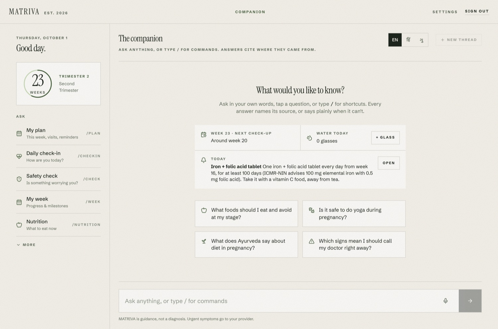</td>
<td width="50%"><b>💬 A cited answer</b><br/>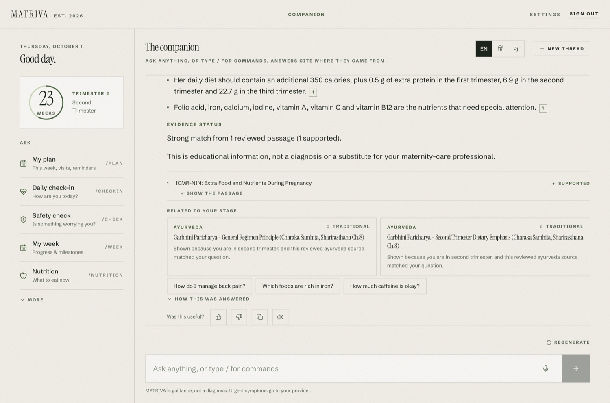</td>
</tr>
<tr>
<td><b>🗓️ My plan</b> — visits, supplements, this week<br/>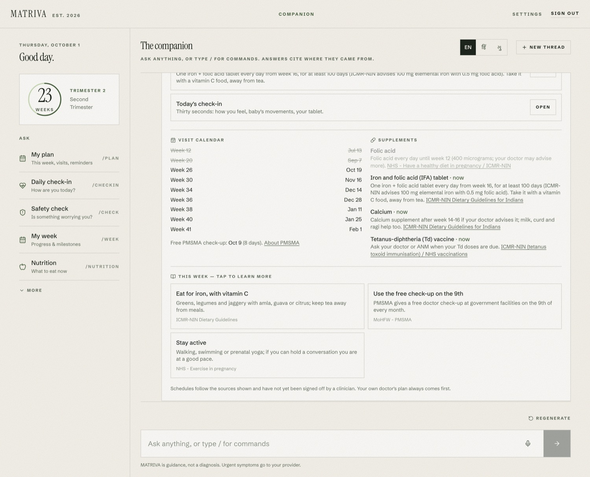</td>
<td><b>🩸 Readings</b> — trend and sourced flags<br/>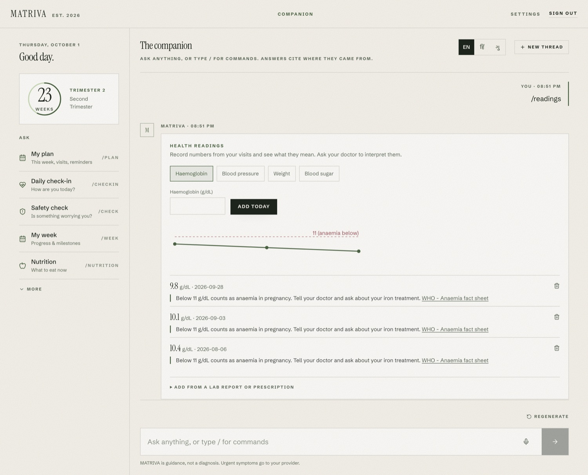</td>
</tr>
<tr>
<td><b>🍛 Meals</b> — what today is missing<br/>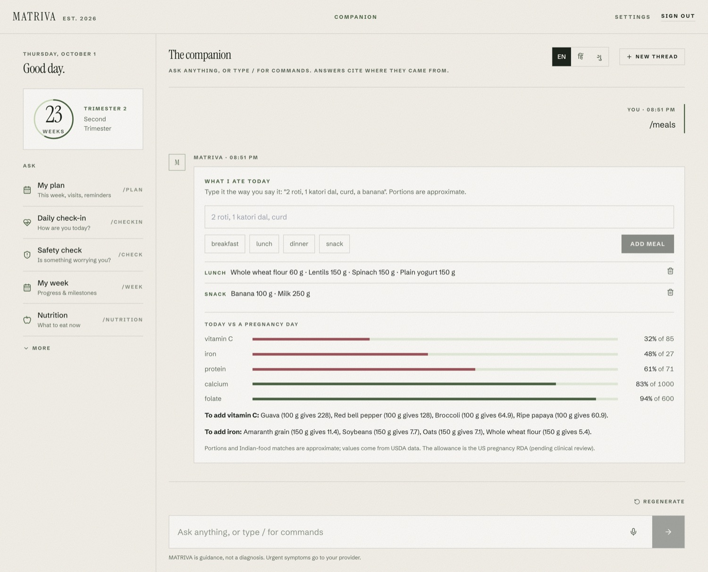</td>
<td><b>📄 Doctor summary</b> — print or save as PDF<br/>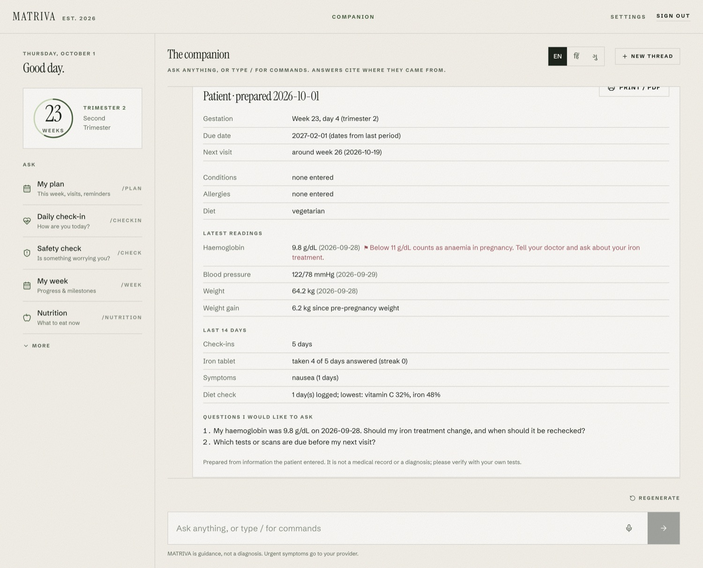</td>
</tr>
<tr>
<td><b>📖 The book</b> — Prasuti Tantra by chapter<br/>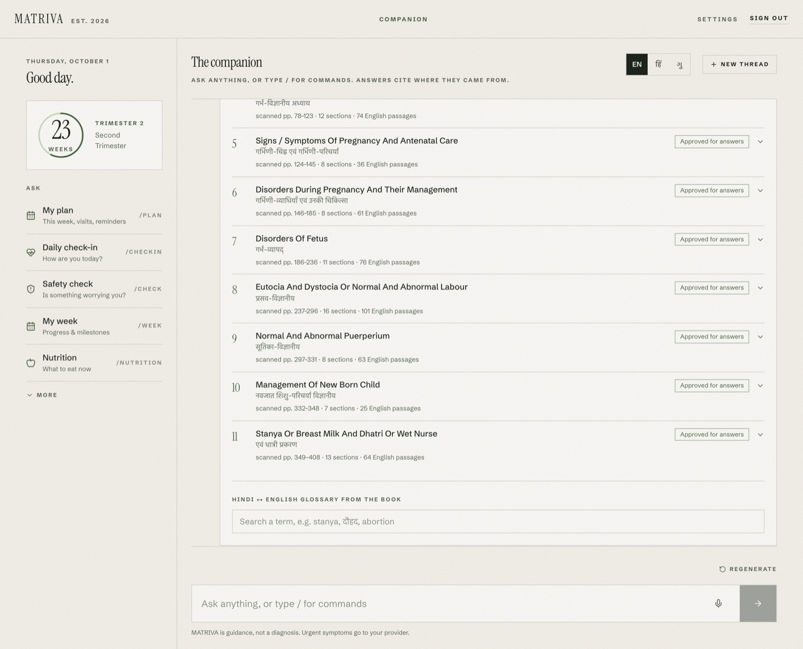</td>
<td><b>🕸️ Knowledge map</b><br/>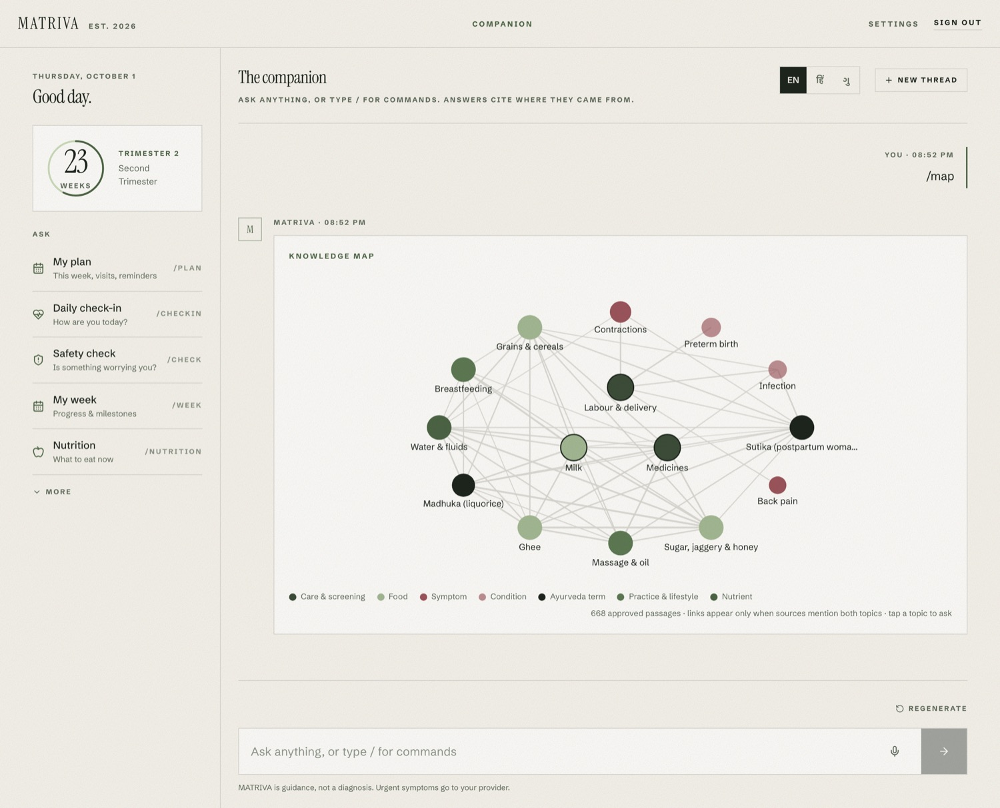</td>
</tr>
<tr>
<td><b>🛡️ Safety check</b><br/>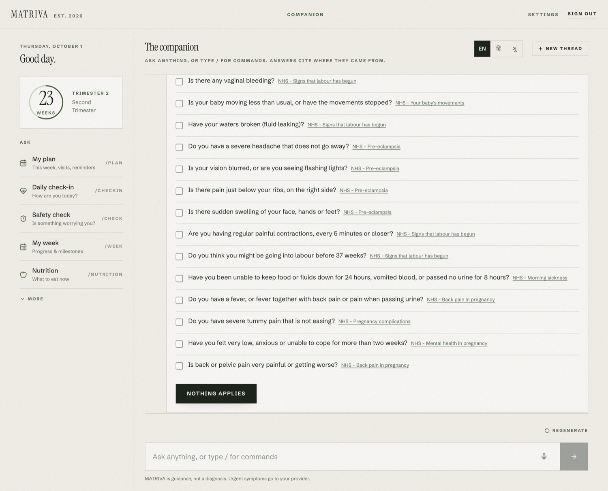</td>
<td align="center"><b>📱 On a phone</b><br/>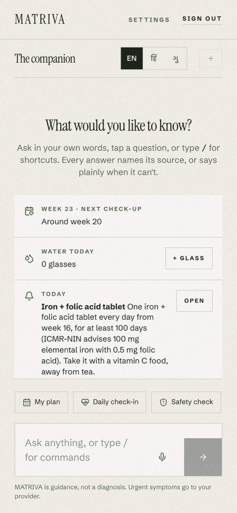</td>
</tr>
</table>

---

## 🧠 How an answer is made

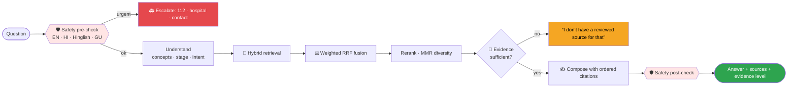

### 🔎 The offline RAG engine — no Groq, no Gemini needed

The default engine (`RAG_ENGINE=local`) runs entirely on your machine. Seven signals are fused:

| Signal | What it catches |
|---|---|
| **BM25** | exact words |
| **Character n-gram TF-IDF** | spelling variants, OCR damage, transliteration |
| **Concept match** | 91 ontology concepts with Hindi/Gujarati synonyms |
| **LSA semantic space** | paraphrases (built from the corpus, no model download) |
| **Structure** | the book's chapter and section titles |
| **Graph activation** | PageRank over a corpus-derived knowledge graph |
| **Pseudo-relevance feedback** | terms from the best hits, to widen recall |

Then an **idf-weighted sufficiency gate** decides whether the evidence is strong enough to answer at all, and an **extractive composer** writes the answer from the passages themselves, so it cannot invent a claim.

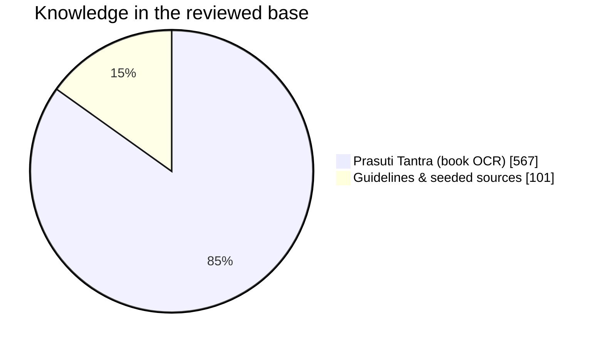

📊 **Measured, not claimed** — on question sets I wrote *after* tuning and never tuned on (the clean set), the right document ranks first **71%** of the time and in the top three **86%**. On the larger mixed set the lexical baseline is already strong (85% → 88% with the full pipeline). Out-of-scope refusal holds at 83–100%. Full ablation tables and known failure modes: [`docs/local-rag.md`](./docs/local-rag.md).

### 📖 The book

A scanned, bilingual copy of **Prasuti Tantra** was OCR'd, its English prose extracted, and its structure (chapters, sections, authorities, glossary) recovered and verified against the body text. 567 chunks are retrievable once approved; where the OCR is too damaged to quote, the answer points to the page instead of guessing. → [`backend/app/data/book_index.json`](./backend/app/data/book_index.json)

---

## 🛡️ Safety by design

**1,231 guard-rail rules**, each with a source, in English, Hinglish, हिन्दी and ગુજરાતી: 918 medicines (including Indian brand names and typos), 205 herbs, foods and exposures, 44 rules tied to your own conditions, 28 warning signs, 15 standing reminders, 9 request rules and 12 checks on the bot's own answer. Tell MATRIVA your conditions, medicines, allergies, age and blood group in Settings and the warnings become personal: a headache is an emergency if you have high blood pressure; a penicillin allergy is called out. Nothing is sent to an AI model.

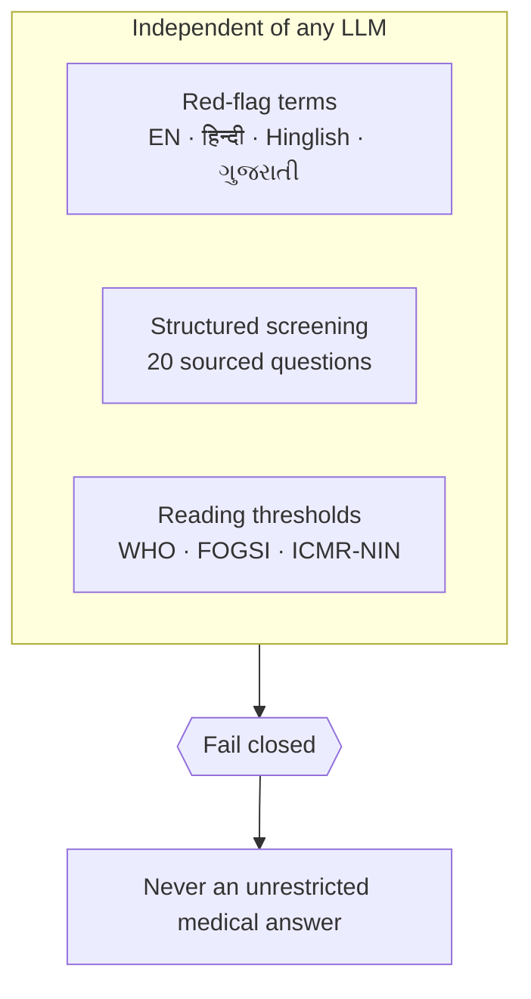

- 🔒 **Medicine questions are never answered.** Not even paracetamol; not a dose, not "safe to take". Cautions go in front of an ordinary answer, and the rule behind each one is one click away with its source.
- 🚫 Safety is its **own module**, never delegated to a language model; if it fails, the system **fails closed**.
- 🏷️ Ayurvedic content is always labelled *traditional* and never presented as modern evidence.
- 🧱 Retrieved text is **data, never instructions** (prompt-injection defence).
- 🔐 Health data is **consent-gated**; withdrawing consent, deleting the profile or the account **purges** it; `/privacy/export` includes it.
- 🧾 Only **approved, active** documents can ground an answer — approving a document is a deliberate human step.

---

## 🏗️ Architecture

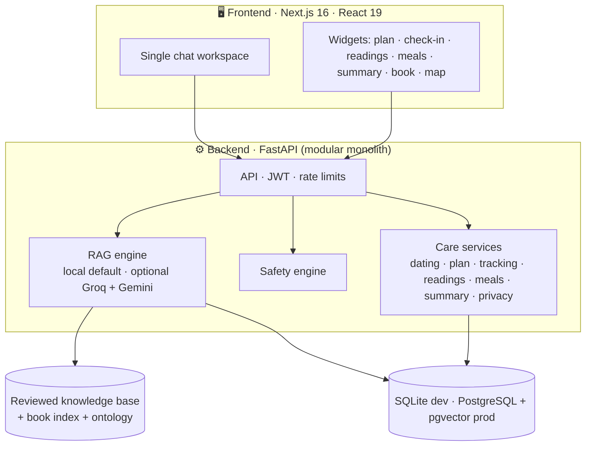

| Layer | Choice |
|---|---|
| Frontend | Next.js 16 (App Router), React 19, TypeScript, Tailwind CSS |
| Backend | Python 3.11, FastAPI, Pydantic, SQLAlchemy, Alembic |
| Database | SQLite (dev) · PostgreSQL + pgvector (prod) |
| Retrieval | Offline hybrid engine (default) · optional Gemini embeddings (`RAG_ENGINE=external`) |
| Generation | Offline extractive composer (default) · optional Groq `openai/gpt-oss-120b` |
| OCR | Tesseract (local) for lab-report photos and the book |
| Auth | JWT, consent versioning |
| Quality | pytest, Playwright, ruff, mypy, ESLint, secret scan |
| Ship | Docker, Docker Compose |

A modular monolith **on purpose**: RAG, safety, API, ingestion and evaluation are cleanly separated without the operational weight of microservices.

---

## 🧪 Quality

| Suite | Result |
|---|---|
| Backend (unit, integration, RAG, care features, guard rails) | **513 passing** |
| Ingestion | **43 passing** |
| Evaluation harnesses | **36 passing** |
| Frontend end-to-end (Playwright, mocked API) | **12 passing** |
| Lint · type-check · production build | clean |
| `npm audit` (production) | **0 vulnerabilities** |

---

## 🚀 Run it

**Prerequisites:** Python 3.11+, Node 20+. Docker is optional. API keys are optional — the offline engine needs none.

```bash
# 1. Backend
cd backend
python -m venv .venv && source .venv/bin/activate
pip install -r requirements.txt -r requirements-dev.txt
cp ../.env.example .env            # set JWT_SECRET (>= 32 chars)
alembic upgrade head
uvicorn app.main:app --reload --port 8010     # docs at /docs

# 2. Frontend
cd ../frontend
npm install
echo "NEXT_PUBLIC_API_URL=http://localhost:8010" > .env.local
npm run dev                         # http://localhost:3000
```

Or everything at once: `docker compose up --build` (see [`docs/deployment.md`](./docs/deployment.md)).

<details>
<summary><b>Load the real knowledge (book + guidelines + library)</b></summary>

```bash
cd backend
python scripts/ingest_real_knowledge.py     # guidelines, foods, book chunks (pending review)
python scripts/build_book_index.py          # book structure, authorities, glossary
# then approve documents as an admin in the Admin page
```
</details>

<details>
<summary><b>Optional: photo reading of lab reports</b></summary>

```bash
brew install tesseract      # macOS;  apt install tesseract-ocr on Linux
```
Pasting the report text works without it.
</details>

<details>
<summary><b>Optional: use Groq and Gemini instead of the offline engine</b></summary>

```bash
# backend/.env
RAG_ENGINE=external
LLM_PROVIDER=groq
LLM_API_KEY=...            # never commit this
EMBEDDING_PROVIDER=gemini
EMBEDDING_API_KEY=...
```
</details>

<details>
<summary><b>Run the tests</b></summary>

```bash
cd backend && pytest -q && ruff check . && mypy app/
cd ../ingestion && pytest tests/
cd ../evaluation && pytest tests/
cd ../frontend && npm run lint && npx tsc --noEmit && npm run build && npx playwright test
```
</details>

---

## 🗂️ Project structure

```
matriva/
├── frontend/                 Next.js app — landing, auth, onboarding, ONE chat workspace, settings, admin
│   ├── app/chat/             the companion (slash commands, widgets, voice)
│   └── components/care/      plan · check-in · readings · meals · summary · safety check
├── backend/
│   ├── app/api/              auth, profile, chat, care, knowledge, admin, privacy, feedback …
│   ├── app/rag/local/        offline engine: index, semantic, graph, retriever, composer, book
│   ├── app/services/care/    dating, plan, screening, tracking, readings, meals, summary, privacy
│   ├── app/safety/           classifier, post-check, prompt-injection defence, guardrails/ (1,231-rule engine)
│   ├── app/data/             ontology.yaml, care_rules.yaml, guardrails/ (rule files), foods_nutrients.json, book_index.json, library.yaml
│   └── tests/                513 tests
├── ingestion/                OCR, chunking, book-structure recovery
├── evaluation/               retrieval / generation / safety / hallucination harnesses + held-out sets
├── knowledge/                seed guidelines, foods, Ayurveda source, resource library builder
└── docs/                     architecture, API, RAG, safety, care features, tech blog
```

---

## 📚 Documentation

| Doc | About |
|---|---|
| [📝 Tech blog](./docs/TECH_BLOG.md) | How and why it was built, with what worked and what didn't |
| [🔎 Local RAG](./docs/local-rag.md) | The offline engine, ablations, held-out results |
| [🥗 What to eat](./docs/food-guide.md) | The book's month-wise regimen and nutrient food lists |
| [🩺 Care features](./docs/care-features.md) | Inputs, user journey, limits, suggested pilot |
| [🔒 Guard rails](./docs/guardrails.md) · [🛡️ Safety](./docs/safety.md) · [⚖️ Compliance](./docs/COMPLIANCE.md) | The 1,231 rules, how a question is checked, and policy alignment |
| [🏛️ Architecture](./docs/architecture.md) · [🔌 API](./docs/api.md) · [🚢 Deployment](./docs/deployment.md) | Engineering reference |
| [📋 Features](./docs/FEATURES.md) · [🗓️ Progress log](./PROGRESS.md) | Scope and history |
| [🏆 Submission](./docs/SUBMISSION.md) · [🖥️ Frontend](./frontend/README.md) · [🌱 Seed data](./database/seed/README.md) | Round 1 write-up, frontend setup, demo seed |

---

## ⚠️ Honest limits

- **Not clinically reviewed.** Every threshold, schedule and screening question cites a source (WHO, FOGSI, ICMR-NIN, NHS) and is marked `pending_clinical_review` in [`care_rules.yaml`](./backend/app/data/care_rules.yaml). A clinician must review it before real use. The Hindi and Gujarati warning phrases need native-speaker review.
- **The guard rails are not clinically verified.** The 1,231 rules were written from public pregnancy-safety knowledge and each names the reference it is consistent with; nobody has yet checked each rule line by line against its reference, and no clinician or pharmacist has signed them off. They err towards "ask your doctor". Unlisted brand names, heavy misspelling, and a medicine described without a name are not recognised. See [`docs/guardrails.md`](./docs/guardrails.md#honest-limits).
- **Approved on instruction, not by a reviewer.** The book and seeded guidelines were approved so answers could flow; they are flagged as not clinically reviewed.
- **The book OCR is imperfect.** Only English prose is used and damaged passages are not quoted.
- **Nutrient numbers are estimates** — USDA per-100g data and everyday portions (a *katori*, a roti).
- **Reminders show only while the app is open.** There is no push or SMS channel yet.
- **Retrieval has known weak spots:** paraphrases with no shared vocabulary, and the occasional rare-word out-of-scope question that slips through. Measured, not hidden — see [`docs/local-rag.md`](./docs/local-rag.md).
- **Branch protection is not enabled** on `main`.

---

## 👥 Team

| | Workstream | Owner |
|---|---|---|
| 🧠 | RAG · AI · Safety · Testing · Review | [@neevmodh](https://github.com/neevmodh) |
| ⚙️ | Backend · Database · API | [@BhavyaSoneji](https://github.com/BhavyaSoneji) |
| 🎨 | Frontend · UI | [@Rajodedra](https://github.com/Rajodedra) |

Ownership routing lives in [`.github/CODEOWNERS`](./.github/CODEOWNERS). After every meaningful change, add a line to [`PROGRESS.md`](./PROGRESS.md).

---

<div align="center">

**Built so a mother can ask, see where the answer came from, and know when to call her doctor.**

🌿 *MATRIVA — from the Sanskrit* मातृ, *mother*

</div>
