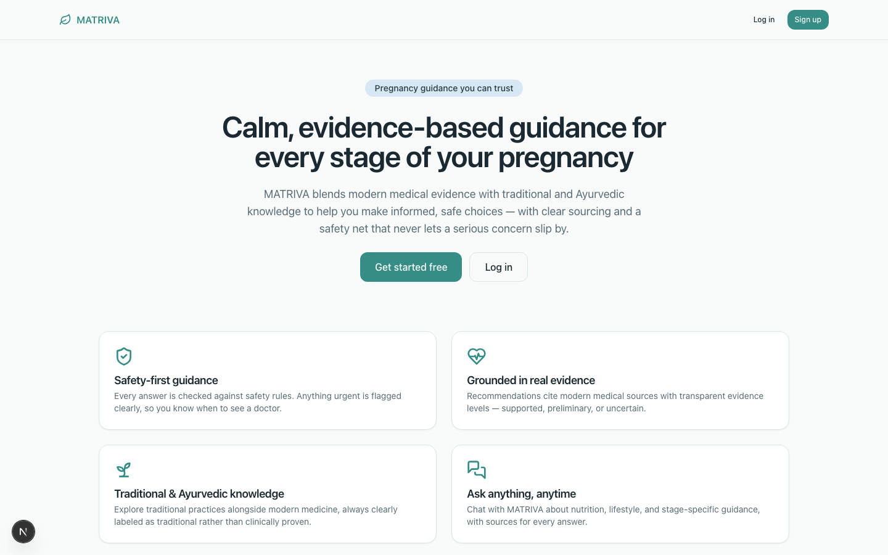
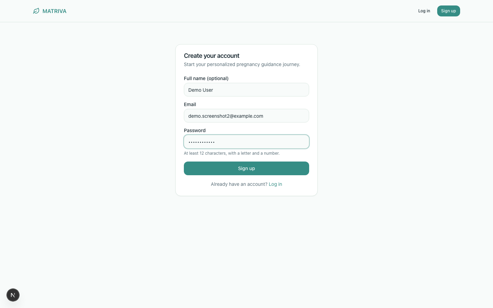
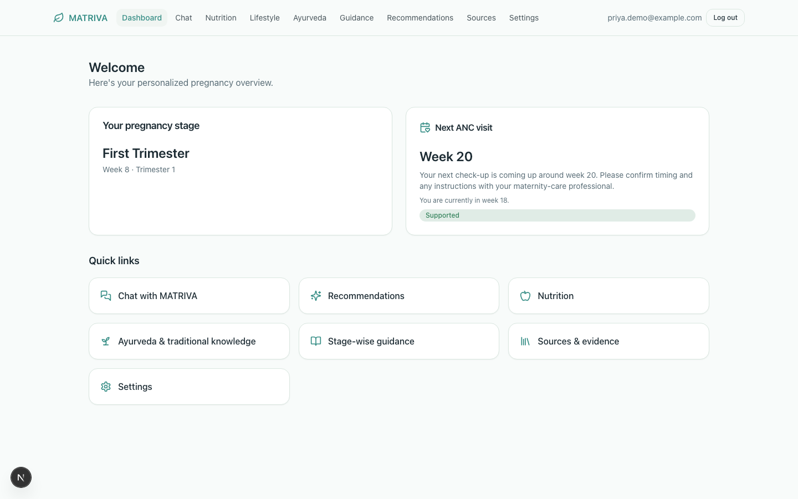
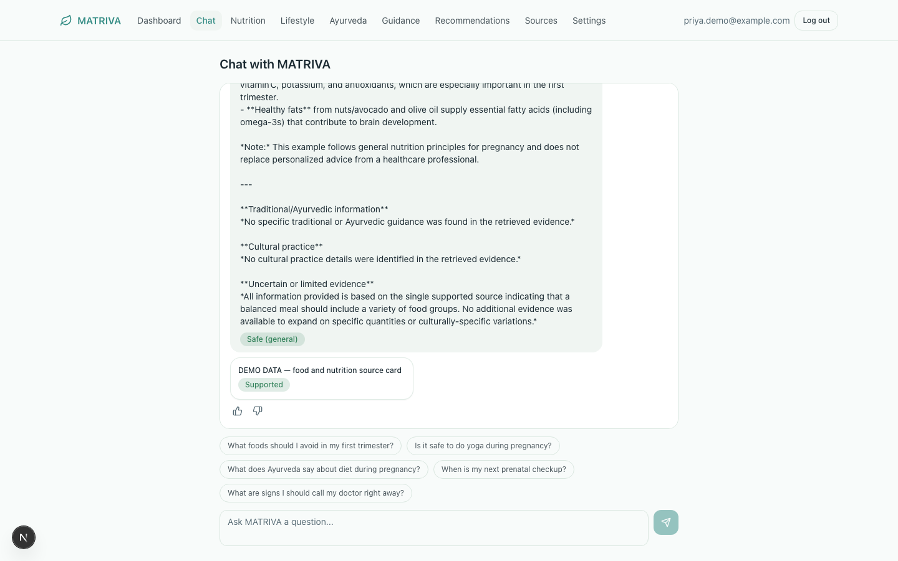
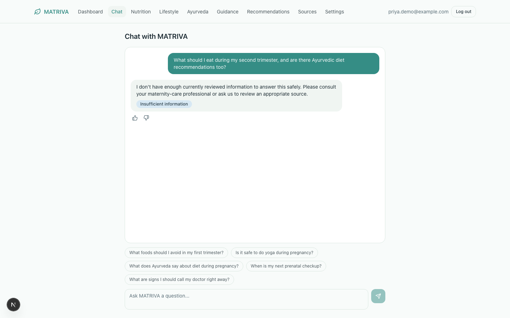
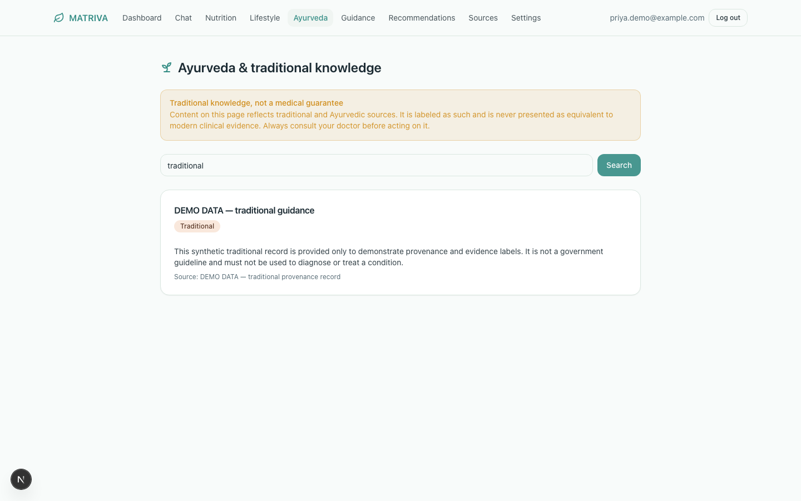
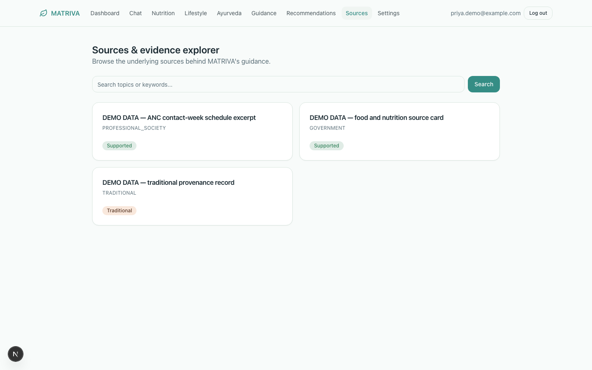

# Health-a-thon 2026 — Round 1 Submission

**Track:** Maternal & Women's Health
**User:** Patient / Caregiver
**Use case:** Patient Education & Digital Engagement
**Repo:** https://github.com/BhavyaSoneji/MATRIVA

> Status: The system, demo, and write-up are complete and verified live (see Demo below). Two
> items remain genuinely open and are marked [TODO] below rather than filled in with placeholders:
> the Clinical Lead's name/credentials (#75, needs a real named reviewer's sign-off) and the exact
> academic citations for the RAG-safety literature (do not paste an unverified reference). Confirm
> the actual submission platform and submit before the Sep 25 close (#76) once those two land.

---

## Problem

Pregnant women navigating nutrition, lifestyle, and traditional-practice questions turn to generic
sources (search engines, social media, family advice) that blend modern medical evidence with
unverified traditional claims — without ever showing which is which, how strong the evidence is,
or when a symptom actually needs a doctor instead of a lifestyle answer. In India specifically,
this is compounded by real demand for Ayurvedic/traditional guidance (e.g. Garbhini Paricharya)
alongside modern antenatal care, with no tool that respects both without conflating them.

## Solution

MATRIVA is a source-grounded pregnancy education assistant. It never lets a language model be the
sole source of truth: every answer is retrieved from a curated, labelled knowledge base spanning
modern medical, Ayurvedic, nutrition, lifestyle, and regional/cultural domains, and is explicitly
separated into **modern medical guidance**, **traditional/Ayurvedic information**, and **uncertain
or limited evidence** before it reaches the user. A rule-based safety layer runs before generation
and can never be overridden by personalization — queries matching obstetric danger signs are
routed to a professional-care escalation message instead of an ordinary answer.

**Round 1 demo scenario:** a patient signs up, completes onboarding (region, dietary preference,
pregnancy stage), lands on a dashboard showing her current stage and next antenatal-care visit from
the FOGSI/WHO 8-contact ANC schedule (weeks 12/20/26/30/34/36/38/40/41), then asks the chat a
nutrition question and receives a cited, source-labelled, evidence-separated answer — or, when the
knowledge base genuinely has nothing relevant, an explicit "insufficient evidence" response instead
of a fabricated one. All of this is captured live in the [Demo](#demo) section below.

```
USER PROFILE → PREGNANCY CONTEXT → QUERY UNDERSTANDING → SAFETY PRE-CHECK →
KNOWLEDGE RETRIEVAL (RAG) → PERSONALIZATION → EVIDENCE FILTERING → SAFETY POST-CHECK →
LLM RESPONSE GENERATION → CITATIONS / SOURCES → USER-FACING RESPONSE
```

## Why it's trustworthy

- **Retrieval before generation, always.** The LLM (Groq) only ever answers from retrieved,
  labelled source material — it does not free-generate medical facts or invent citations.
- **Explicit evidence separation.** Every response distinguishes modern medical guidance from
  traditional/Ayurvedic content and flags uncertain evidence, rather than presenting all
  information with equal authority.
- **Independent, rule-based safety layer.** Safety is never delegated solely to the LLM. A
  pre-check keyword layer (obstetric danger signs — bleeding, severe headache/vision change,
  reduced fetal movement, severe abdominal pain, convulsions, fluid leak, high fever, severe
  swelling, persistent vomiting) short-circuits to a professional-care escalation message before
  the RAG/LLM pipeline runs at all. The system fails closed: if safety validation fails, the raw
  LLM response is never returned.
- **Sourced, not asserted.** Every knowledge entry carries `source`, `source_type`, and
  `evidence_level` metadata. Traditional/Ayurvedic content is explicitly labelled and requires
  clinical review sign-off before being presented as demo- or production-ready content — nothing
  is surfaced as verified until a qualified reviewer has checked it.
- **Grounded in established references and current safety-in-AI research:** FOGSI Good Clinical
  Practice Recommendations, the WHO 2016 antenatal-care model (8-contact schedule), Charaka
  Samhita (Sharirasthana, Garbhini Paricharya), and the broader academic literature on
  safety-constrained/grounded generation for medical LLM applications. [TODO: confirm and insert
  exact citations/DOI or arXiv links for the RAG-safety papers named in the brief — do not present
  unverified bibliographic details as confirmed].

## Feasibility in 60–90 days

The architecture is deliberately staged so a working (if narrow) system exists from day one and
widens in scope without rework:

| Phase | Scope | Status |
|---|---|---|
| Sprint 0 (Round 1, by Sep 25) | Hand-curated seed knowledge (FOGSI schedule, Garbhini Paricharya, IFCT foods), minimal `/chat` + visit-schedule endpoint, minimal chat UI | **Done and exceeded** — see below |
| Sprint 1 (if shortlisted, Oct 5 – Nov 8) | Full ingestion pipeline (parsing, semantic chunking, metadata/quality checks), Gemini embeddings + pgvector, hybrid retrieval + reranking, full safety classifier (pre + post-check), citation validation, intent classification, retrieval/generation/safety evaluation harnesses | **Already done, ahead of schedule** — live-verified against real Groq and Gemini APIs, not just scaffolded |
| Sprint 2+ | Personalization engine, recommendation engine, multi-domain query decomposition, admin/review tooling, full product frontend, deployment hardening | **Already done, ahead of schedule** — full FastAPI backend + full Next.js frontend (auth, onboarding, dashboard, chat, nutrition/lifestyle/ayurveda/guidance, recommendations, sources explorer, settings/privacy, admin dashboards) all built and wired end-to-end |

The original plan staged this over 60–90 days; the actual build moved faster than planned, so what
follows describes the **current, working state**, not a projection. Remaining open items are
tracked honestly rather than glossed over: a retrieval-precision gap in the hallucination test
suite when running without live embedding credentials (issue #19, fixed when live keys are
available — see Limitations in the main [README](../README.md)), and the process items in
[Team](#team) below (Clinical Lead sign-off, branch protection).

We are not building a general-purpose medical chatbot or attempting diagnosis — scope is
intentionally narrow (education + safe escalation) so the 60–90 day window is spent on evidence
quality and safety correctness rather than breadth.

## Team

| Role | Name | Background |
|---|---|---|
| RAG / AI / Safety / Testing / Code Review | [@neevmodh](https://github.com/neevmodh) | — |
| Backend | [@BhavyaSoneji](https://github.com/BhavyaSoneji) | — |
| Frontend | [@Rajodedra](https://github.com/Rajodedra) | — |
| Clinical Lead | [TODO: name] | BAMS, MS-Gynaecology scholar — reviews all Ayurvedic/traditional content and the ANC visit schedule before anything ships (see [#75](https://github.com/BhavyaSoneji/MATRIVA/issues/75)) |

## Demo

Screenshots below are from the actual running application (local stack, seeded demo data, live
Groq + Gemini API keys) — not mockups. Full-resolution images are in
[`docs/screenshots/`](./screenshots/).

**Landing page**



**Sign-up**



**Personalized dashboard**, showing the real pregnancy-stage summary and a next-ANC-visit card
computed live from the FOGSI/WHO 8-contact schedule against the user's current week:



**AI chat — a real grounded answer.** The response is retrieved from the seeded knowledge base,
generated by a live Groq call, and shown with its source card and evidence-level label
(`Supported`), split into modern/traditional/cultural/uncertain sections and safety-labelled
`Safe (general)`:



**AI chat — the safety guarantee.** For a question the knowledge base has no real evidence for, the
system returns the fixed "insufficient information" response and labels it clearly — the LLM is
never given the chance to fill the gap from general knowledge (Section 43 guarantee, verified in
`evaluation/hallucination/`):



**Ayurveda / traditional knowledge**, explicitly labelled `Traditional` and never presented as
equivalent to modern clinical evidence:



**Sources & evidence explorer**, showing every underlying source with its evidence level:



## Repository

https://github.com/BhavyaSoneji/MATRIVA

---

### Notes for whoever finalizes this (assigned: @neevmodh, blocking #76)

Everything that could be built, verified, and written without a human-only input is done: the full
system, the live-verified demo, the screenshots, and this write-up. What's left needs a real person,
not another automated pass:

1. **[TODO] Clinical Lead name/credentials** (blocks #75) — must come from the actual team member;
   this is a real medical review, not a formality, and will not be invented or assumed.
2. **[TODO] Academic RAG-safety citations** — the brief names MAM-AI, MamaBench, and
   safety-constrained LLM papers; exact titles/authors/links for these have not been verified and
   won't be fabricated, so confirm and paste the real references before submitting.
3. **[TODO] Confirm the submission platform and submit** (#76) — locate the actual Round 1 form
   (check healthathon.reskilll.com or the reskilll community platform, per #76's description) and
   submit this doc + the screenshots/repo link before the Sep 25 close. This is a human action on an
   external platform outside this repo's automation.
4. This doc assumes the Ayurveda/ANC-schedule content stays flagged pending review (per
   [`knowledge/seed/seed.yaml`](../knowledge/seed/seed.yaml)) unless #75 has actually closed by
   submission time — if it hasn't, say so plainly in the write-up rather than implying sign-off
   happened.
