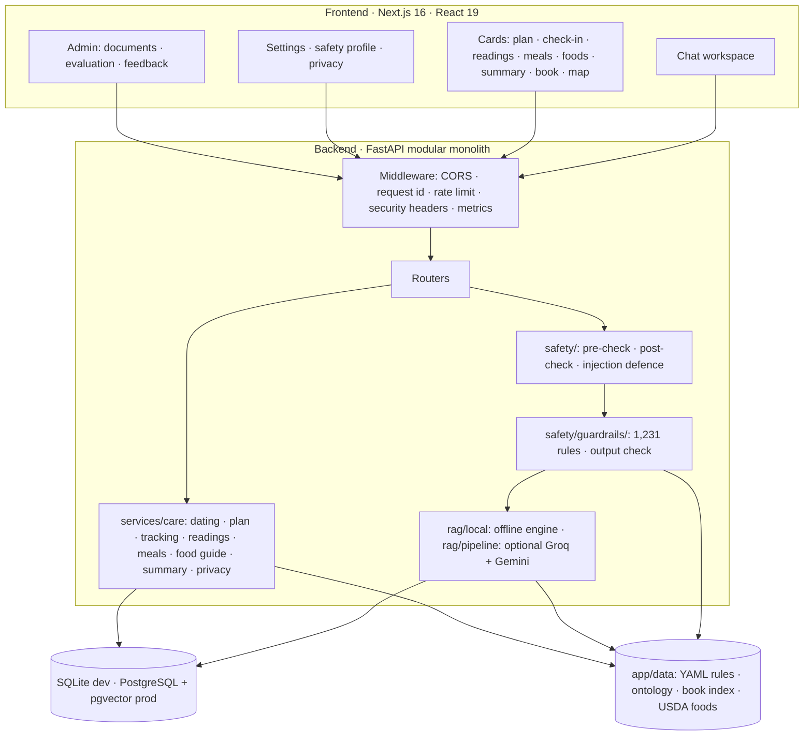

# Architecture

MATRIVA is one chat workspace in front of one FastAPI backend. Everything that decides what a patient is told, the safety rules, the retrieval, the guard rails and the care logic, runs in the backend, in code and data that can be read and tested.



## Modules

| Folder in `backend/app/` | Responsibility |
|---|---|
| `api/` | HTTP routers: auth, profile, chat, care, knowledge, recommendations, resources, wellness, privacy, feedback, admin, evaluations |
| `core/` | Settings, database, security (hashing, JWT), rate limiter, Redis client, observability |
| `safety/` | Pre-check classifier, post-check validator, prompt-injection defence |
| `safety/guardrails/` | The rule engine: registry loader, matcher, request context, output check |
| `rag/local/` | The offline engine: index, semantic space, graph, retriever, composer, book |
| `rag/` (other files) | The optional external pipeline: query rewriting, hybrid retrieval, reranking, context packet, translation |
| `llm/` | Groq client, prompts, grounded generator (external engine only) |
| `evidence/` | Citation validation, Ayurveda provenance |
| `services/` | Chat orchestration, profile, personalisation, recommendations, stage, audit, evaluation |
| `services/care/` | Dating, plan, screening, tracking, readings, meals, food guide, summary, privacy purge and export |
| `models/`, `schemas/`, `repositories/` | SQLAlchemy entities, Pydantic contracts, knowledge queries |
| `data/` | YAML and JSON that are data, not code: guard-rail rules, care rules, food guide, ontology, book index, nutrient table, resource library |

## Original sketch

The diagram below is the first design of the request path. It is kept because the trust boundaries that follow still apply.

MATRIVA uses a modular monolith. The API, safety layer, RAG adapter, domain engines, and
persistence share one deployable backend while remaining separated by folders and contracts.

```text
HTTP client
   │
   ▼
FastAPI middleware (CORS, request ID, rate limit, security headers, metrics)
   │
   ├── auth / profile / privacy
   ├── chat ── safety pre-check ── retrieval adapter ── grounded generator
   │                                  │                    │
   │                                  └── approved chunks   └── post-check/citations
   ├── knowledge / sources / guidelines
   ├── recommendations / food / lifestyle
   ├── care (dating, plan, check-ins, readings, meals, screening, summary)
   └── admin / evaluation / audit
             │
             ▼
       SQLAlchemy models
             │
      PostgreSQL + pgvector
```

## Retrieval engines

`RAG_ENGINE=local` (default) runs a fully offline hybrid engine in `backend/app/rag/local/`
(BM25, character n-grams, concepts, LSA, structure, graph activation, pseudo-relevance
feedback, weighted RRF, rerank, MMR, a sufficiency gate and an extractive composer). It needs no
API key and cannot add a claim that is not in an approved passage. `RAG_ENGINE=external`
re-enables the Groq + Gemini pipeline. Details: [`local-rag.md`](./local-rag.md).

## Care services

`backend/app/services/care/` holds the deterministic engines behind the care features:
`dating` (week from last period or due date), `plan`, `tracking` (check-ins, reminders),
`screening` (red-flag triage), `readings` (validation, sourced flags, report parsing), `meals`
(USDA per-100 g nutrients, daily gaps), `summary`, and `privacy` (purge/export). Thresholds
and schedules live in `backend/app/data/care_rules.yaml`, not in code. See
[`care-features.md`](./care-features.md).

## Trust boundaries

1. **Untrusted input:** HTTP bodies, uploads, query parameters, and chat text are validated
   and length-limited.
2. **Untrusted retrieved text:** document chunks are wrapped as data blocks and are never
   treated as system instructions.
3. **Approved evidence:** ordinary retrieval requires both an active document and an approved
   source. Government/professional/traditional source types remain distinct.
4. **LLM output:** treated as untrusted until citation, source, dangerous-claim, and escalation
   checks pass.
5. **Sensitive data:** passwords are one-way hashes; health data is consent-gated; logs contain
   request metadata and hashes, not raw questions, answers, tokens, or profile fields.

## Database

Migrations: `0001` initial schema, `0002` RAG vector index, `0003` daily wellness logs,
`0004` care features (dating, check-ins, readings, meals, screening, emergency contact).
The initial migration creates users, consent and profile tables, conversations/messages,
knowledge sources/documents/chunks, evidence and guideline metadata, Ayurveda provenance,
food/lifestyle records, recommendations, feedback, safety rules/events, audit logs, and
evaluation runs. JSON is used for bounded structured metadata so the same model can run in
SQLite tests and PostgreSQL production. A production pgvector migration can replace the
portable embedding column without changing API contracts.

## External dependencies

LLM and embedding providers are optional adapters. Missing or failing providers trigger a
source-grounded local fallback or a safe service-unavailable response. The API never treats
provider availability as clinical approval.
