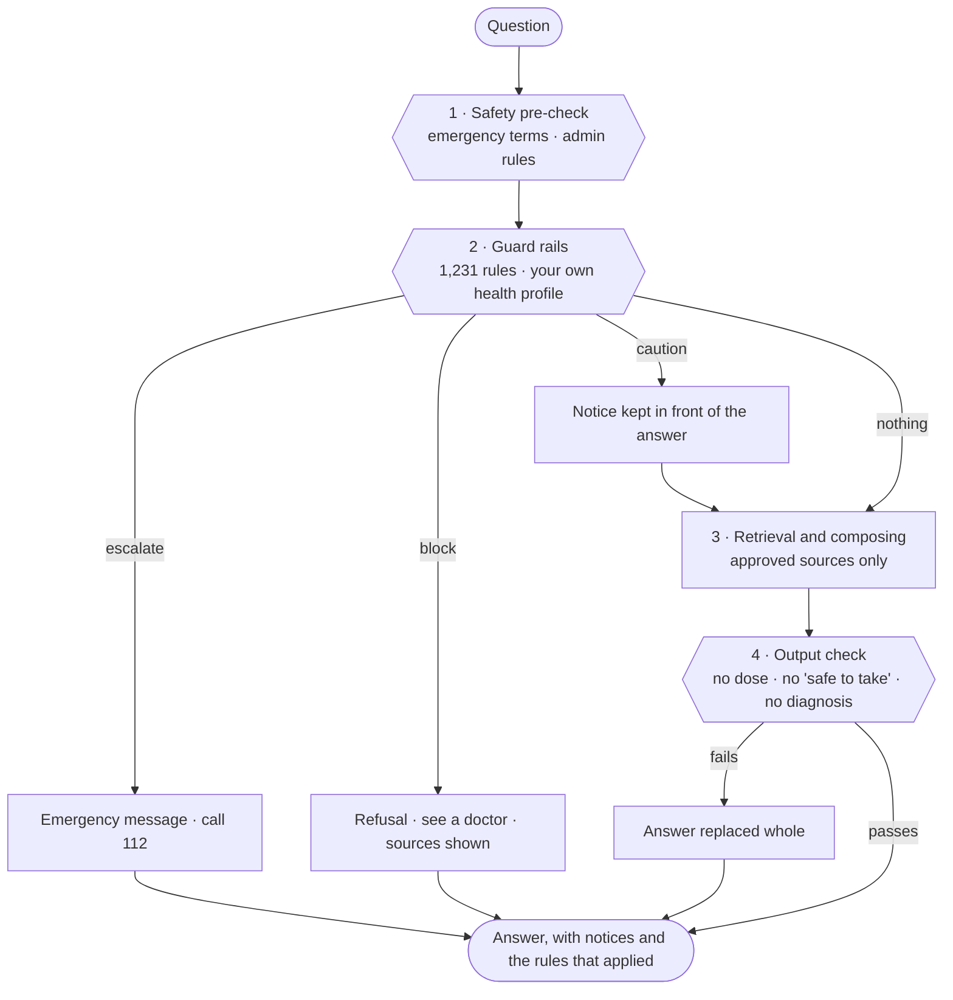

# Guard rails

MATRIVA's chat does not give medical advice, and it never recommends, approves, doses, starts, stops or changes a medicine. These are the rules that make that true. They run in the backend itself (`backend/app/safety/guardrails/`), they are **not** an AI model, and they behave the same way every time.



## What the registry holds

Counts come from the code, not from memory: run `python -m app.safety.guardrails` in `backend/`.

| Kind | Rules | What a rule is | Files |
|---|---:|---|---|
| Medicines | 918 | One medicine (generic name plus the brand and local names people type), with a class and a reason | `medicines_prescription.yaml`, `medicines_specialist.yaml`, `medicines_common.yaml`, `vaccines.yaml`, `medications.yaml` |
| Substances | 205 | One herb, Ayurvedic formulation, food, drink, habit or exposure | `herbs.yaml`, `foods.yaml`, `exposures.yaml`, `substances.yaml` |
| Conditions | 44 | A rule that applies because of what you told us (for example high blood pressure plus a headache) | `condition_rules.yaml` |
| Symptoms | 28 | A warning sign, optionally limited to some weeks | `symptoms.yaml` |
| Standing reminders | 15 | A reminder shown once at the start of a chat | `watch.yaml` |
| Requests | 9 | What is being asked for: a dose, a medicine, stopping a medicine, a home abortion, the baby's sex, acting as a doctor | `requests.yaml` |
| Output checks | 12 | A check on the bot's own answer | `output.yaml` |
| **Total** | **1,231** | about 9,700 trigger phrases in English, Hinglish, Hindi and Gujarati, from 40 named sources | |

Medicine classes (`classes.yaml`):

| Class | Rules | What the chat says |
|---|---:|---|
| `contraindicated` | 87 | Known to harm the baby (isotretinoin, warfarin, methotrexate, misoprostol, ACE inhibitors and ARBs, valproate...). Refuses, and tells you to call your doctor today without stopping other medicines. |
| `avoid` | 185 | Doctors usually advise against it in pregnancy (NSAIDs, tetracyclines, fluoroquinolones, statins, live vaccines...). Refuses. |
| `doctor_only` | 436 | A prescription medicine (antibiotics, antiepileptics, antidepressants, insulin, thyroid, blood thinners, HIV and TB treatment...). Will not say whether to start, stop or change it. |
| `otc_ask` | 182 | Sold without a prescription (paracetamol, cough syrups, antacids, skin creams...). Still refers you to a doctor or pharmacist. |
| `herbal` | 124 | Herbs, Ayurvedic products, diet pills, cleansing treatments. Treated as medicines. |
| `supplement` | 4 | Programme iron, folic acid, calcium, vitamin D. Allowed as prescribed, with a warning against doubling up. |
| `vaccine` | 23 | Recommended vaccines are timed by your doctor or ANM; live vaccines are avoided. |
| food and exposure classes | 82 | Warn, and the answer continues. |

## What happens to a question

| Action | Meaning | Example |
|---|---|---|
| **escalate** | An emergency. The chat gives the emergency message (112, 102 ambulance, Tele-MANAS 14416, Women Helpline 181 where they apply) and nothing else runs. | "my baby is not moving since morning", "heavy bleeding", "I want to die" |
| **block** | Not answered here. The chat refuses, says why, names the sources, and sends you to a doctor. No retrieval, no model. | "can I take ibuprofen", "which tablet for cold", "how to abort at home", "boy or girl?" |
| **caution** | Answered as usual, with a notice kept in front. | "can I drink coffee", "can I eat raw papaya" |

Escalate beats block, and block beats caution. A guard rail can only make an answer safer; nothing here can lower the base safety decision.

How the match works (`engine.py`):

- Text is lower-cased, normalised, and split into words. Phrases of up to seven words are looked up directly.
- **Typos are tolerated** for medicine and substance names of seven or more letters (one edit: `doxycylcine` matches doxycycline).
- Hindi and Gujarati words are matched by prefix, so inflected forms work. Devanagari and Gujarati vowel signs are kept.
- Request and symptom rules also use patterns (for example *stop / skip / double ... my ... tablet*), and may need another word to be present (`with`) or absent (`unless`: dosing questions about iron tablets are not blocked).
- **General questions are not alarms.** "What are the warning signs of pre-eclampsia?" gets information plus one line ("if this is happening to you now, get medical help"). "I have a severe headache and blurry vision" is an emergency. A few rules (baby moving less, self-harm, violence at home) are always treated as personal.
- **A prescribed medicine is treated differently.** "My doctor prescribed Thyronorm, what should I avoid eating?" becomes a caution, not a refusal. A medicine that harms the baby is never waved through.
- A rule can be limited to weeks of pregnancy (`min_week`, `max_week`). An unknown week never hides a warning.
- The same phrase is only ever attached to the narrowest rule that names it, so one question never produces two overlapping notices.

## What it knows about you

With consent, the guard rails read your pregnancy week and, from the safety profile in Settings, your **conditions, current medicines, allergies, pregnancy history and risks, age and blood group**. They are never sent to an AI model. If you withdraw consent, delete your profile or delete your account, they are removed; `/privacy/export` includes them.

| You tell us | What changes |
|---|---|
| A condition, for example high blood pressure | A headache becomes an emergency; fasting, exercise, salt, "stop my BP tablet" get specific notices; a standing reminder appears once at the start of a chat |
| A current medicine | If it is one that harms the baby or is usually avoided, you are told once at the start of a chat |
| An allergy, for example penicillin | A question about amoxicillin says you listed an allergy |
| Rh-negative blood group | A fall or bleeding triggers an anti-D reminder |
| Previous caesarean, preterm birth, miscarriage or stillbirth | Matching warning signs are treated as more serious |
| Age under 18 or 35 and over | A standing reminder with the extra care that applies |

Your list of medicines and conditions is also printed on the one-page summary for your doctor.

## What the bot says is checked too

Whatever wrote an answer (the offline engine quotes approved passages; the optional external model writes new text), it is replaced whole if it:

- gives a dose, frequency or duration for a medicine (programme supplements and nutrient amounts are allowed);
- calls a medicine "safe", or says you "can take" it;
- names a medicine to avoid without saying so;
- explains how to start labour, a period or an abortion;
- diagnoses you, predicts the baby's sex, or promises a cure or no risk;
- reassures falsely ("nothing to worry about"), or tells you to stop a medicine or skip care;
- says alcohol, tobacco or drugs are fine, or helps find out the baby's sex.

## Adding or changing a rule

Rules are data. A new medicine is one line in a group in `backend/app/data/guardrails/`:

```yaml
groups:
  - cls: doctor_only                      # see classes.yaml
    why: "antibiotics are only for infections your doctor has diagnosed"
    src: [nhs-medicines, acog]            # keys from sources.yaml; a missing key fails the tests
    items: ["cefaclor|distaclor", "cefdinir|omnicef"]   # generic name | brand | brand
```

Then run `python -m pytest tests/test_guardrails.py`. The tests fail if an id repeats, a source key is unknown, a rule has no message, an emergency rule lacks Hindi or Gujarati, or any ordinary question in the retrieval benchmarks (`evaluation/local_rag/`) is blocked.

## Languages

English, Hinglish (Roman Hindi), Hindi and Gujarati terms are matched. Refusals, emergency messages and every medicine class are written in all three, and the reply follows the language of the question. The Hindi and Gujarati text has not been reviewed by a native speaker (issue #91).

## Honest limits

- **Not clinically verified.** The rules were written from public pregnancy-safety knowledge. Each names the reference it is consistent with (`sources.yaml`), but nobody has yet checked each rule line by line against that reference, and a clinician or pharmacist has not signed any of it off. Treat it as a strong first draft that errs towards "ask your doctor", not as a drug database.
- **The brand list is incomplete.** Indian brand names change; an unlisted brand is matched only if its generic name is also typed.
- **Matching is by words.** Heavy misspelling, an unusual transliteration, or a medicine described without a name ("the white tablet my aunt gave me") is not recognised. The offline engine and the output check still apply.
- **Negation is not understood.** "I did not take ibuprofen" still triggers the ibuprofen notice. This errs on the safe side.
- **The "general question or personal report" split is a heuristic**, tested on a set of examples, not a language model.
- **It cannot know what it was not told.** The safety profile is only as good as what you entered.
- A refusal is not an answer. The user is sent to a doctor, who may be hard to reach; the messages therefore name 112, ANM/ASHA, free government care (JSSK, PMSMA on the 9th) and the helplines where they apply.
