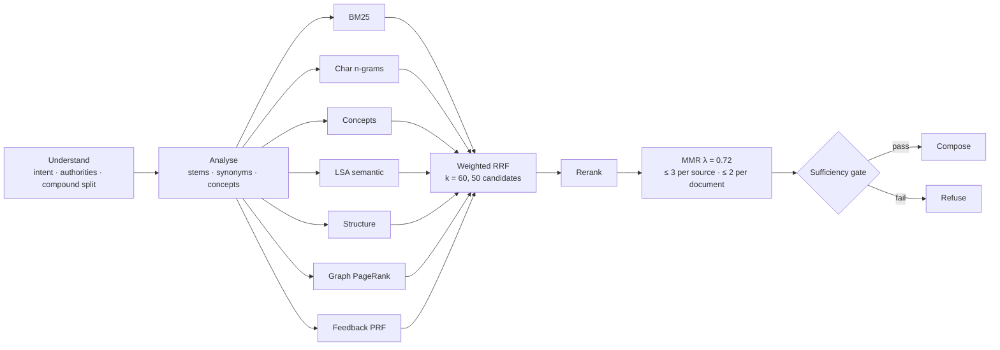

# RAG pipeline

How a question becomes a cited answer, end to end. Two engines sit behind one function,
`app.rag.pipeline.answer_question()`:

| | `RAG_ENGINE=local` (default) | `RAG_ENGINE=external` |
|---|---|---|
| Retrieval | Offline hybrid engine, 7 signals | Gemini embeddings + pgvector, keyword and metadata filters, rerank |
| Generation | Extractive composer: quotes approved passages | Groq `openai/gpt-oss-120b`, grounded prompt |
| Needs | Nothing (no API key, no network) | `LLM_API_KEY`, `EMBEDDING_API_KEY`; optional `TAVILY_API_KEY` for labelled web results |
| Can invent a claim | No, every sentence is a quote | Guarded by citation validation and the post-check |
| Code | `backend/app/rag/local/` | `backend/app/rag/pipeline.py`, `retrieval.py`, `reranking.py`, `context_packet.py` |

If the external path fails for any reason it falls back to the grounded local answer, never to
an unrestricted one. The offline engine is documented in depth (signals, ablation, held-out
results) in [`local-rag.md`](./local-rag.md); this page is the overview and the contract.

## The request path

```mermaid
flowchart TD
    Q([POST /chat or /chat/stream]) --> I[Classify intent]
    I --> P{{Safety pre-check<br/>rules, EN · HI · Hinglish · GU}}
    P -- urgent / high risk --> ESC[Fixed escalation message<br/>no retrieval, no model]
    P -- ok --> T[Prepare the turn<br/>user context · follow-up resolution · translate to English]
    T --> ACT{Plain statement?<br/>"my Hb is 9.8"}
    ACT -- yes, consented --> REC[Record reading or meal, confirm]
    ACT -- no --> R[answer_question]
    R --> G{Evidence sufficient?}
    G -- no --> N[Fixed insufficient-evidence answer]
    G -- yes --> C[Compose with numbered citations]
    C --> PC{{Safety post-check}}
    PC -- fails --> SAFE[Safe replacement answer]
    PC -- passes --> OUT
    N --> OUT
    SAFE --> OUT
    ESC --> OUT
    REC --> OUT
    OUT([Answer · citations · sources · safety status · trace · follow-ups])
```

Order matters and is enforced in `backend/app/services/chat.py`:

1. **Safety pre-check first**, before any retrieval or model call, in both the blocking and
   streaming endpoints. Urgent and high-risk questions are answered with the fixed escalation
   message and nothing else runs. If the classifier itself errors, the request fails closed with
   a `503`.
2. **Prepare the turn.** Build the user's context (stage, region, diet, allergies, language),
   resolve a follow-up such as "what about ragi?" against the last three questions, and
   translate Hindi, Gujarati or Hinglish to an English search query. The user's original
   wording is kept for display.
3. **Retrieve and judge** (below). No sufficient evidence means no answer.
4. **Compose** and cite.
5. **Safety post-check** on the generated text, then persist the turn.

Questions never write to the profile. Statements (readings, meals) are recorded only with
consent and only when the pre-check found the message safe.

## Inside the local engine



**Corpus.** Only passages that are in an *active* document with `review_status = approved` and
an *approved* source are indexed (`corpus.py`). The index and concept graph are cached under a
fingerprint of the approved set (document count, newest update, chunk count), so approving,
rejecting or reindexing a document rebuilds them on the next question.

**Fusion.** Each signal produces its own ranking; they are merged with weighted reciprocal rank
fusion. Weights: BM25 1.0, structure 0.8, n-grams 0.7, concepts 0.7, feedback 0.5, semantic 0.4,
graph 0.3. Every signal can be switched off through `Config`, which is how the ablation study works.

**Rerank and diversify.** Coverage, term proximity, concept coverage, title match, semantic
similarity, section match, evidence strength, text quality, stage fit and diet fit adjust the
fused score. A prior pushes scanned-OCR text down on everyday questions. MMR keeps results
varied, with at most 3 passages per source, 2 per document and 2 per-food nutrient tables.

**Sufficiency gate.** The step that makes "I don't have a source for that" possible. An answer
is allowed only if the idf-weighted coverage of the question's terms is high enough: by the
best sentence (0.30), by the best passage (0.34), or by the top passages together (0.50).
Below that, the result is `sufficient = false`, no text is composed and the caller returns the
fixed insufficient-evidence response. This gate is lexical, so a rare shared word can still let
an out-of-scope question through; that failure mode is measured in `local-rag.md`.

**Composer.** Chooses real sentences (definitions for "what is", numbers for "how much", the
named authority for "what does Caraka say"), drops near-duplicates, separates modern from
traditional content, numbers the citations in order, and adds stage, allergy and diet notes.
Where a passage is too damaged to quote, it points to the page instead.

## What comes back

`POST /chat` returns:

| Field | Meaning |
|---|---|
| `answer` | Composed text, an escalation message, an insufficient-evidence message, or a post-check replacement |
| `citations` | Up to four, in the order the answer uses them: source, locator (e.g. *Ch. 5 › Dauhrda, scanned p. 130*), evidence level |
| `sources` | Full source cards (type, evidence level, review status) |
| `safety_status` | `safe_general`, `low_concern`, `medical_review`, `high_risk`, `urgent_escalation` or `insufficient_information` |
| `intent` | Classified intent |
| `trace` | Engine, confidence, concepts found, query terms, per-signal contribution, passages searched; shown in the trace panel |
| `suggestions` | Suggested next questions from the same corpus |

External web results, when enabled, are appended as separate citations typed `external_web`
with evidence level `uncertain` and a real URL; they are never merged with reviewed sources.

## Guarantees

- **Approved evidence only.** An unapproved document can never ground an answer. With nothing
  approved the chat says it has no evidence.
- **Retrieval before generation.** The default engine has no generator. The optional one only
  sees retrieved passages.
- **Retrieved text is data.** The prompt-injection layer treats passages as quoted data, never
  as instructions.
- **Refusal is an outcome, not an error.** Insufficient evidence returns a fixed message with
  `insufficient_information`; a model is never allowed to fill the gap.
- **Fail closed.** A failing safety classifier returns `503`; a failing external provider falls
  back to the grounded local answer.
- **Traditional is labelled.** Ayurvedic passages carry the `traditional` evidence level and
  are never presented as modern evidence.
- **Privacy in logs.** Safety events store a hash of the query, not the question.

## Operating it

```bash
# load the real knowledge (chapters and guidelines arrive pending review)
python backend/scripts/ingest_real_knowledge.py
python backend/scripts/build_book_index.py
# then approve documents in Admin → Documents; the index rebuilds itself
```

| Setting | Effect |
|---|---|
| `RAG_ENGINE` | `local` (default) or `external` |
| `LLM_PROVIDER`, `LLM_API_KEY`, `LLM_MODEL` | External generation |
| `EMBEDDING_PROVIDER`, `EMBEDDING_API_KEY`, `EMBEDDING_MODEL` | External retrieval |
| `TAVILY_API_KEY` | Optional labelled web results, external engine only |

## Testing and evaluation

| What | Where |
|---|---|
| Engine unit tests, advanced signals | `backend/tests/test_local_rag.py`, `test_local_rag_advanced.py` |
| Regression floor on the development question sets (fails CI on regress) | `backend/tests/test_local_rag_eval.py` |
| Pipeline, streaming, grounding, citation validation, post-check | `test_pipeline_*.py`, `test_grounding.py`, `test_citation_validation.py`, `test_post_check.py` |
| Safety, multilingual red flags, prompt injection | `test_pre_check.py`, `test_classifier.py`, `test_multilingual_safety.py`, `test_prompt_injection.py` |
| Retrieval, generation, safety and hallucination harnesses; held-out sets and ablation | `evaluation/` and `evaluation/local_rag/` |

Headline numbers, on questions written after tuning (clean set): right document first 71%,
in the top three 86%, out-of-scope refused 83%. The tuned set (95% / 100%) flatters the engine
and should not be quoted as the real figure. Details and failure modes are in `local-rag.md`.

## Knowledge document & chunk schema (#1)

Pydantic models: [`backend/app/schemas/knowledge.py`](../backend/app/schemas/knowledge.py).
Defined per Master Prompt Section 9 (Knowledge Document Model), Section 10 (Knowledge Domains),
Section 11 (Ayurveda Data Rule), and Section 14 (Chunking Strategy). Maps to the `knowledge_documents`,
`knowledge_chunks`, and `ayurvedic_sources` tables from Section 8 once the ORM models land.

### `KnowledgeDocument`

| Field | Type | Notes |
|---|---|---|
| `document_id` | str | |
| `title` | str | |
| `content` | str | |
| `domain` | `Domain` enum | `MODERN_MEDICAL`, `AYURVEDA`, `NUTRITION`, `LIFESTYLE`, `REGIONAL_CULTURAL` (Section 10) |
| `subdomain` | str? | e.g. `antenatal_care`, `garbhini_paricharya` |
| `source_id` | str | |
| `source_type` | `SourceType` enum | `medical_guideline`, `clinical_reference`, `textbook`, `ayurvedic_classical_source`, `traditional_reference`, `nutrition_reference`, `institutional_guidance` (Section 9). Do not invent sources outside these types. |
| `publication_date` | str? | |
| `version` | str | default `"1.0"` |
| `language` | str | default `"en"` |
| `region` | str? | |
| `pregnancy_stage` | str? | |
| `topic` | str? | |
| `evidence_level` | `EvidenceLevel` enum | see below |
| `review_status` | `ReviewStatus` enum | default `UNVERIFIED` |
| `reviewed_by` | str? | |
| `reviewed_at` | datetime? | |
| `safety_tags` | list[str] | |
| `ayurvedic_provenance` | `AyurvedicProvenance`? | **required when `domain == AYURVEDA`** — enforced by the model, not just convention |

### `KnowledgeChunk`

| Field | Type | Notes |
|---|---|---|
| `chunk_id` | str | |
| `document_id` | str | |
| `source_id` | str | |
| `domain` | `Domain` enum | |
| `topic` | str? | |
| `pregnancy_stage` | str? | |
| `evidence_level` | `EvidenceLevel` enum | |
| `region` | str? | |
| `language` | str | default `"en"` |
| `content` | str | chunk text (not in Section 14's metadata list, but obviously required) |
| `chunk_index` | int | position within parent document |
| `token_count` | int? | |

Target 300-700 tokens per chunk, structure-preserving (heading/section/source/page/paragraph
relationship) — the actual chunking algorithm is #3.

### `AyurvedicProvenance` (Section 11: AYURVEDA DATA RULE)

Traditional knowledge must **never** be silently converted into a modern medical claim. Every
Ayurvedic source retains:

`source`, `book`, `chapter`, `verse_or_page`, `original_text`, `translation`, `interpretation`,
`traditional_context`, `modern_evidence_status` (an `EvidenceLevel`, set explicitly and
independently of the traditional content itself).

### `EvidenceLevel`

The **only** evidence-label vocabulary the Master Prompt defines (Section 11), and it's used
generically across all domains — Section 9 and Section 14 both reference an `evidence_level`
field with no domain-specific enum of their own:

`TRADITIONAL`, `PRELIMINARY`, `LIMITED_EVIDENCE`, `MIXED_EVIDENCE`, `SUPPORTED`, `UNCERTAIN`,
`NOT_ESTABLISHED`.

Only use a label that can actually be justified by the curated source/reviewer — don't default to
`SUPPORTED` just because a source looks authoritative.

> **Note:** `knowledge/seed/seed.yaml` (#65, Sprint 0) originally used a non-spec value
> (`ESTABLISHED`) for modern-medical/nutrition entries before this schema was formalized. It's
> been corrected to `SUPPORTED` to match this vocabulary.

### `ReviewStatus`

Not explicitly enumerated in the Master Prompt beyond "if a source has not been verified, mark it
`UNVERIFIED`" (Section 9). `UNVERIFIED` is that generic state; `PENDING_SOURCE_VERIFICATION` and
`PENDING_CLINICAL_REVIEW` are this project's refinement so tooling can distinguish *why* something
isn't cleared (a numeric/factual claim needing a source check, vs. traditional/clinical content
needing the Clinical Lead's sign-off — see [#75](https://github.com/BhavyaSoneji/MATRIVA/issues/75)).

`UNVERIFIED`, `PENDING_SOURCE_VERIFICATION`, `PENDING_CLINICAL_REVIEW`, `REVIEWED_APPROVED`,
`REJECTED`.

## Retrieval metadata filtering (Section 13, forward reference for #6)

Retrieval must not rely solely on embeddings — combine with metadata filters, e.g.
`pregnancy_stage = second_trimester AND domain IN (MODERN_MEDICAL, NUTRITION, AYURVEDA) AND
region = Gujarat` when region-specific info is relevant. Don't over-filter in a way that removes
important general medical information. Implemented in the retrievers; the local engine also
uses stage and diet as rerank signals rather than hard filters.

## Backend/API integration

The API uses a small SQLAlchemy-to-RAG adapter. It converts approved ORM chunks into the
canonical Pydantic chunks and hands them to the configured engine (`local` by default). The HTTP
contract is `app.rag.pipeline.answer_question()`.

Only active, approved documents from approved sources are eligible. Guideline registry entries
that are retired or past their review due date are excluded. The demo seed is synthetic and must
not be presented as a complete or current clinical corpus; the real corpus (Prasuti Tantra
chapters, guidelines, foods) is loaded with `backend/scripts/ingest_real_knowledge.py` and stays
pending until an admin approves it.
