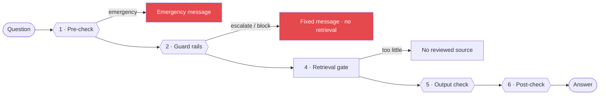

# Safety

Safety is independent of any language model and runs before and after an answer is made. It is written as plain rules and data, so it behaves the same way every time and can be read, tested and reviewed. If any part of it fails, MATRIVA fails closed: it refuses instead of guessing.

## The layers

| # | Layer | Runs | What it does | Page |
|---|---|---|---|---|
| 1 | Emergency pre-check | before anything | Red-flag terms and admin rules short-circuit to an emergency message | [Pre-check](#pre-check) |
| 2 | Guard rails | before retrieval | 1,231 sourced rules: escalate emergencies, refuse medicine advice, add cautions; personal to the user's conditions | [`guardrails.md`](./guardrails.md) |
| 3 | Prompt-injection defence | while retrieving | Retrieved text is data, never instructions | [Post-check](#post-check) |
| 4 | Retrieval gate | during retrieval | Only approved, active documents; too little evidence means no answer | [`rag.md`](./rag.md) |
| 5 | Output check | after composing | Replaces any answer that gives a dose, calls a medicine safe, diagnoses, or falsely reassures | [`guardrails.md`](./guardrails.md#what-the-bot-says-is-checked-too) |
| 6 | Post-check | after composing | Validates citations and escalation language | [Post-check](#post-check) |
| 7 | Structured screening | outside chat | 20 sourced yes/no questions and reading thresholds, applied by rules | [Structured screening](#structured-screening) |

Two rules hold across all of them: **a layer can only make an answer safer, never less safe**, and **the user is always given somewhere to go**: 112, a doctor, an ANM or ASHA, or a helpline.

## Pre-check

The classifier normalizes input and routes configured emergency, high-risk, medication, and
medical-review patterns. A match short-circuits normal generation and returns a professional
care/emergency escalation message. Safety rules are stored in `safety_rules`, versioned,
reviewed, and manageable by administrators.

The pre-check understands English, Hindi, Hinglish and Gujarati red-flag phrases. The Hindi and
Gujarati wording still needs native-speaker review.

## Guard rails

Before any retrieval, a rule engine of 1,231 rules checks the question for medicines (918), herbs, foods and exposures (205), warning signs, risky requests (a dose, which medicine to take, stopping a medicine, a home abortion, the baby's sex) and what the person has told us about their own conditions, medicines and allergies. It escalates emergencies, refuses medicine advice, and puts cautions in front of an ordinary answer. A second check on the answer itself replaces any answer that gives a dose, calls a medicine safe, diagnoses, or falsely reassures. Details, the full rule list and the limits are in [`guardrails.md`](./guardrails.md).

## Structured screening

Separately from chat, `/care/screening` asks about 20 yes/no questions filtered by the week of
pregnancy and returns an **emergency / urgent / soon** outcome with the source of each question
(WHO, FOGSI, NHS), one-tap 112, the mother's emergency contact and a hospital map link. A daily
check-in answer that is a danger sign triggers the same card. Reading thresholds (Hb < 11 g/dL,
BP 140/90 and 160/110) are applied by rules, never by a model. All of it is in
`backend/app/data/care_rules.yaml`, marked `pending_clinical_review`.

## Post-check

Generated text is rejected or replaced when it:

- contains a dangerous treatment/medication instruction;
- omits escalation for a high-risk query;
- cites a source that was not retrieved; or
- has no approved source for a grounded answer.

The system fails closed if the safety subsystem, retrieval dependency, or required source
set is unavailable. A `503` response is intentional and must not be replaced with a guessed
answer.

## Privacy and abuse controls

- Explicit consent is required before profile/pregnancy data is stored.
- Consent withdrawal deletes the associated profile data.
- Account export and deletion are available to the account owner.
- Chat session context is separate from permanent profile records.
- Raw health text, passwords, JWTs, and generated answers are excluded from normal logs.
- Rate limits apply to auth, chat, and public knowledge routes.
- Uploads are extension/MIME/size checked, hashed, reviewed, and indexed before activation.
- Audit records cover document decisions, safety-rule changes, exports, deletions, and consent.

Clinical thresholds and wording require qualified medical review. Engineering tests cannot
certify clinical correctness or replace a clinical governance process.
